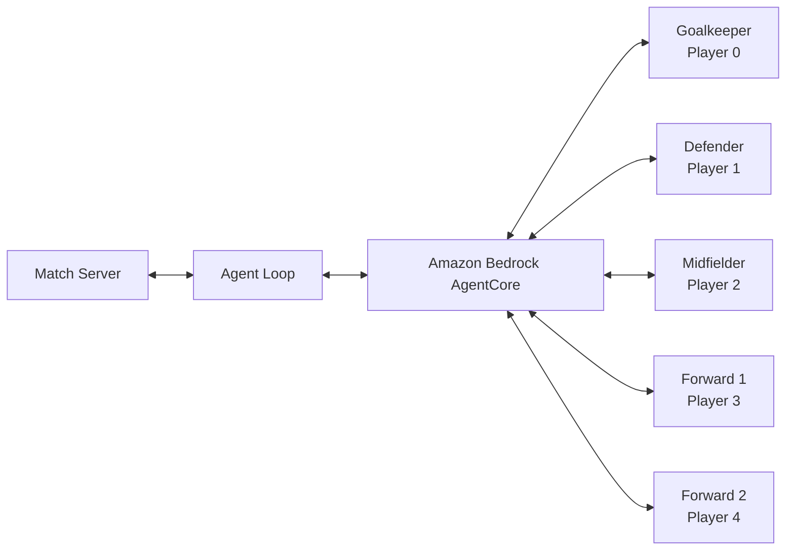
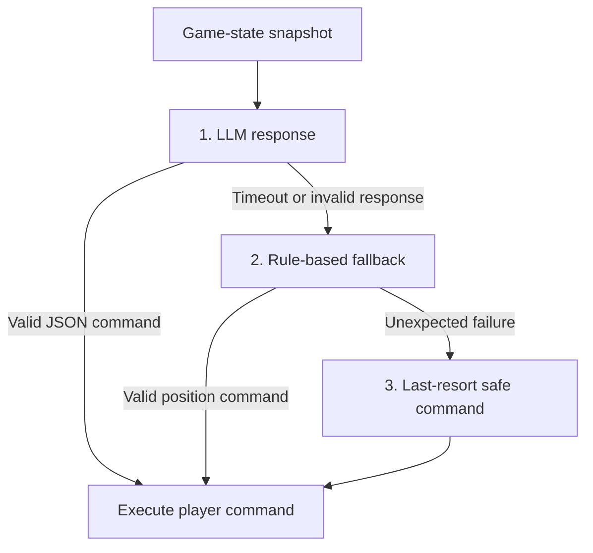

# Agentic AI Football Cup

A multi-agent AI football simulation where five role-based players coordinate in real time to defend, create chances, and score goals.

This project adapts the AWS Agentic Football Cup sample into deployable, position-specific agents built with the [Strands Agents SDK](https://github.com/strands-agents/sdk-python) and Amazon Bedrock AgentCore.

## What is included

- Five specialist agents: goalkeeper, defender, midfielder, and two forwards
- A balanced `1-1-1-2` tactical formation
- LLM-driven decisions with position-specific system prompts
- Rule-based fallbacks when an LLM response is unavailable or invalid
- Tolerant JSON parsing for reliable in-game commands
- Local tests and scripts to deploy the full team to Amazon Bedrock AgentCore
- Alternative tactical implementations: balanced, aggressive, defensive, memory-enabled, and gateway-based teams

## How it works

Every two seconds, each agent receives a snapshot of the match state: ball and player positions, possession, score, stamina, current actions, and coach instructions. The agent returns a valid command for its assigned player.



The shared library handles agent construction, match-state parsing, command validation, error recovery, and safe fallback behavior.

## Project structure

```text
agentic-football-sample-agents/
├── BUILD_AND_DEPLOY.md              # Complete workshop and deployment guide
├── lib/                             # Shared library used by every team
│   ├── agent_base.py                # Agent factory and invoke handler
│   ├── fallback.py                  # Position-specific fallback behavior
│   ├── parsing.py                   # JSON command extraction
│   ├── state.py                     # Game-state summaries for the LLM
│   ├── _bootstrap.py                # Runtime library-path resolution
│   └── test_helpers.py              # Mock AgentCore and match-state fixtures
├── ai-team-strands-balanced/        # Balanced 1-1-1-2 team
├── ai-team-strands-extremely-aggressive/
├── ai-team-strands-extremely-defensive/
├── ai-team-strands-memory/          # Team with memory capabilities
└── ai-team-strands-gateway/         # Team with tactical gateway tools
```

Each team includes five player agents, deployment scripts, and a team README:

```text
ai-team-strands-balanced/
├── ai-gk/                           # Goalkeeper (Player 0)
├── ai-def/                          # Defender (Player 1)
├── ai-mid/                          # Midfielder (Player 2)
├── ai-fwd1/                         # Forward 1 (Player 3)
├── ai-fwd2/                         # Forward 2 (Player 4)
├── deploy-all-windows.ps1           # PowerShell deployment script
├── deploy-all.sh                    # Bash deployment script
├── deploy_all.py                    # Cross-platform deployment script
└── README.md
```

Every player agent contains `src/main.py`, an AgentCore configuration template, Python dependencies, and local tests.

## Resilient agent design

Each agent controls one player through a position-specific system prompt and uses three layers of protection to keep play moving:



The fallback layer uses tactical rules appropriate to each role. If every prior layer fails, a safe command such as `SET_STANCE` prevents the player from freezing during a match.

## Quick start

### Prerequisites

- Python 3.10+
- Node.js 20+ and npm
- AWS CLI configured with credentials
- AWS account with Amazon Bedrock model access
- [AgentCore CLI](https://docs.aws.amazon.com/bedrock-agentcore/latest/devguide/runtime-getting-started.html), AWS CDK, and [uv](https://docs.astral.sh/uv/)

### Test locally

```bash
cd agentic-football-sample-agents/ai-team-strands-balanced
python3 ai-gk/test_local.py
```

To test an agent with a real model response, use:

```bash
python3 ai-gk/test_local.py --llm
```

### Deploy the balanced team

```bash
cd agentic-football-sample-agents/ai-team-strands-balanced
AWS_DEFAULT_REGION=us-east-1 python deploy_all.py
```

For complete setup instructions, the command contract, architecture details, and both no-code and code-based deployment paths, see [Build and Deploy an AWS Agentic Football Team](agentic-football-sample-agents/BUILD_AND_DEPLOY.md).

## Player roles

| Player | Role | Default model |
| --- | --- | --- |
| 0 | Goalkeeper | Nova Micro |
| 1 | Defender | Nova Lite |
| 2 | Midfielder | Nova Pro |
| 3 | Forward 1 | Nova Micro |
| 4 | Forward 2 | Nova Lite |

## Contributing

Experiment with tactical prompts, model choices, fallback configurations, and team formations. Run the local tests before deploying changes to AgentCore.
